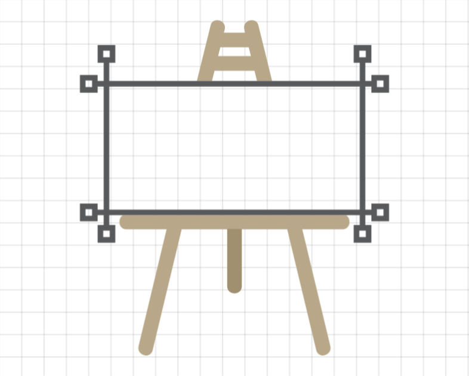

<!DOCTYPE html>
<html lang="en">

<head>
    <meta charset="UTF-8">
    <meta name="viewport" content="width=device-width, initial-scale=1.0">
    <meta name="description" content="Draw with your pointer on the HTML canvas, then get the code to render it." itemprop="description">
    <meta name="keywords" content="draw, mouse, pointer, html, canvas, code, render" itemprop="keywords">
    <meta name="author" content="Viraj Bijpuria" itemprop="author">
    <meta property="og:title" content="Draw on the HTML canvas without code" itemprop="name">
    <meta property="og:description" content="Draw with your pointer on the HTML canvas, then get the code to render it." itemprop="description">
    <meta property="og:image" content="https://vbprodev.github.io/Canvascript/CanvaScript.png" itemprop="image">
    <meta property="og:url" content="https://vbprodev.github.io/Canvascript/" itemprop="url">
    <meta property="og:type" content="website">
    <link rel="canonical" href="https://github.com/VBproDev/Canvascript">
</head>

<body itemscope itemtype="https://schema.org/SoftwareApplication">

<meta itemprop="name" content="Canvascript">
<meta itemprop="description" content="A no-code tool for creating HTML canvas graphics. Draw with your pointer on the canvas, then generate the code to render it. Ideal for web game developers.">
<meta itemprop="applicationCategory" content="GraphicsApplication">
<meta itemprop="operatingSystem" content="Any">
<meta itemprop="softwareVersion" content="1.0">
<meta itemprop="creator" content="Viraj Bijpuria">
<meta itemprop="url" content="https://vbprodev.github.io/Canvascript/">
<meta itemprop="image" content="https://vbprodev.github.io/Canvascript/CanvaScript.png">
<meta itemprop="downloadUrl" content="https://github.com/VBproDev/Canvascript">
<meta itemprop="sameAs" content="https://discord.gg/ZXMEkzfZXx">

<h1 itemprop="headline">About this</h1>

Create HTML canvas graphics without writing code. Just draw your graphics, then get the code to render them on the HTML canvas.

A no-code tool for web game devs and researchers crafting mobile-friendly high-performance graphics, effortlessly. You can now draw freehand too.

We also have a <a href="https://discord.gg/ZXMEkzfZXx" target="_blank" itemprop="sameAs">Discord server</a> btw

<h1 itemprop="headline">Features</h1>
<ul>
    <li itemprop="featureList">Automatic code generation</li>
    <li itemprop="featureList">Draw curved, straight and even freehand lines</li>
    <li itemprop="featureList">Share and save your designs</li>
    <li itemprop="featureList">Control the width and color of the brush</li>
    <li itemprop="featureList">Test your graphics on multiple resolutions</li>
</ul>

<h1 itemprop="headline">How to use?</h1>

It's a web tool hosted on GitHub Pages, so no need to install anything. Just click on the link in the <b>About</b> section (top in mobile, top-right in desktop) and start drawing!

<h1>Love Canvascript?</h1>

Help us make it even better!

<ul>
    <li>⭐ Star the project to show your support.</li>
    <li>🛠️ Contribute by reporting issues or submitting pull requests.</li>
    <li>📣 Share Canvascript with fellow web game devs to spread the word.</li>
</ul>
</body>
</html>
